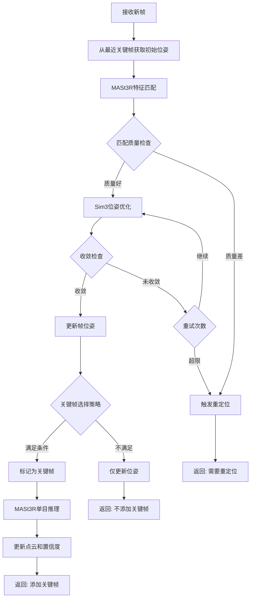
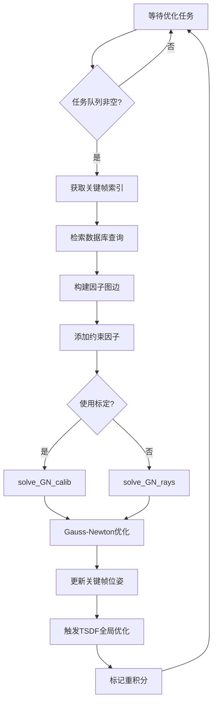
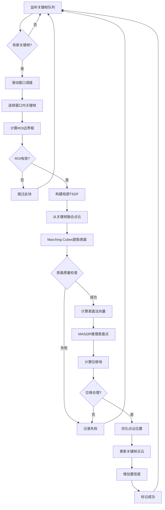
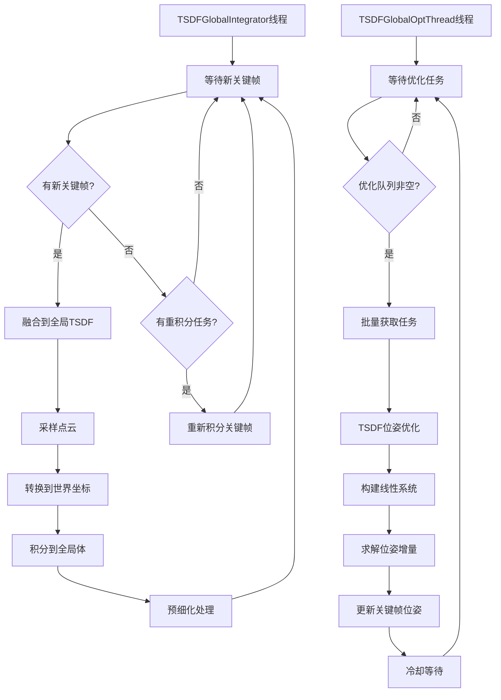
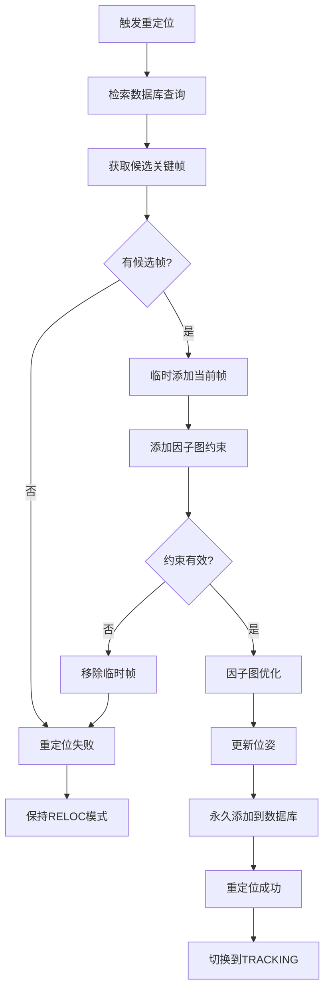

# MASt3R-SLAM-dualTSDF 算法框架流程图

## 1. 系统架构概览

```
┌─────────────────────────────────────────────────────────────────┐
│                         Main Process                             │
│  ┌──────────────┐  ┌──────────────┐  ┌──────────────┐          │
│  │  Front-End   │  │   Backend    │  │ Visualization│          │
│  │   Tracking   │  │   Process    │  │   Process    │          │
│  └──────────────┘  └──────────────┘  └──────────────┘          │
│         │                  │                  │                  │
│         ├──────────────────┼──────────────────┤                  │
│         │   Shared Memory  │                  │                  │
│  ┌──────▼──────────────────▼──────────────────▼──────┐          │
│  │  SharedKeyframes & SharedStates (Manager)  │          │
│  └─────────────────────────────────────────────────────┘          │
│                                                                   │
│  ┌─────────────────────────────────────────────────────┐         │
│  │         Asynchronous Services                        │         │
│  │  ┌────────────┐  ┌────────────┐  ┌────────────┐    │         │
│  │  │  Quality   │  │    TSDF    │  │    TSDF    │    │         │
│  │  │  Service   │  │  Refiner   │  │   Global   │    │         │
│  │  │ (Process)  │  │  (Thread)  │  │  (Thread)  │    │         │
│  │  └────────────┘  └────────────┘  └────────────┘    │         │
│  └─────────────────────────────────────────────────────┘         │
└─────────────────────────────────────────────────────────────────┘
```

## 2. 主流程与并行进程交互 (Main Loop & Parallel Processes)

```
┌─────────────────────────────────────────────────────────────────────────────────────────┐
│                                    主进程 (Main Process)                                 │
│                                                                                          │
│  ┌─────────────────┐      ┌──────────────────────────────────────────────────┐         │
│  │   程序启动      │──────▶│  初始化: 配置/数据集/共享内存/MASt3R模型        │         │
│  └─────────────────┘      └──────────────────────────────────────────────────┘         │
│                                                │                                         │
│                                                ▼                                         │
│         ┌──────────────────────────────────────────────────────────────────┐            │
│         │                    启动三个并行进程/服务                          │            │
│         └──────────────────────────────────────────────────────────────────┘            │
│                  │                        │                        │                     │
└──────────────────┼────────────────────────┼────────────────────────┼─────────────────────┘
                   │                        │                        │
    ┌──────────────▼──────────┐  ┌─────────▼──────────┐  ┌─────────▼──────────┐
    │  后端进程 (Backend)     │  │ 可视化进程 (Viz)   │  │  异步服务线程      │
    │  ═══════════════════    │  │  ═══════════════   │  │  ═══════════════   │
    │                         │  │                    │  │                    │
    │ ┌─────────────────────┐ │  │ ┌────────────────┐ │  │ ┌────────────────┐ │
    │ │ 监听优化任务队列    │ │  │ │ 读取共享内存   │ │  │ │ Quality Service│ │
    │ │ states.global_      │ │  │ │ 渲染关键帧     │ │  │ │ (独立进程)     │ │
    │ │ optimizer_tasks     │ │  │ │ 显示轨迹       │ │  │ │ ┌────────────┐ │ │
    │ └─────────┬───────────┘ │  │ │ 用户交互       │ │  │ │ │ 接收请求   │ │ │
    │           │             │  │ └────────────────┘ │  │ │ │ 评估质量   │ │ │
    │           ▼             │  │         │          │  │ │ │ 返回结果   │ │ │
    │ ┌─────────────────────┐ │  │         ▼          │  │ │ └────────────┘ │ │
    │ │ 检索数据库查询      │ │  │ ┌────────────────┐ │  │ │                │ │
    │ │ 构建因子图          │ │  │ │ 通过viz2main   │ │  │ ┌────────────────┐ │
    │ │ - 添加边约束        │ │  │ │ 发送控制信号   │ │  │ │ TSDF Refiner   │ │
    │ │ - MASt3R匹配        │ │  │ │ (暂停/继续)    │ │  │ │ (独立线程)     │ │
    │ └─────────┬───────────┘ │  │ └────────────────┘ │  │ │ ┌────────────┐ │ │
    │           │             │  │                    │  │ │ │ 监听队列   │ │ │
    │           ▼             │  │                    │  │ │ │ 滑动窗口   │ │ │
    │ ┌─────────────────────┐ │  │                    │  │ │ │ TSDF构建   │ │ │
    │ │ Gauss-Newton优化    │ │  │                    │  │ │ │ 表面提取   │ │ │
    │ │ - solve_GN_rays()   │ │  │                    │  │ │ │ 点云优化   │ │ │
    │ │ - solve_GN_calib()  │ │  │                    │  │ │ └────────────┘ │ │
    │ └─────────┬───────────┘ │  │                    │  │ │                │ │
    │           │             │  │                    │  │ ┌────────────────┐ │
    │           ▼             │  │                    │  │ │ TSDF Global    │ │
    │ ┌─────────────────────┐ │  │                    │  │ │ (2个线程)      │ │
    │ │ 更新关键帧位姿      │ │  │                    │  │ │ ┌────────────┐ │ │
    │ │ SharedKeyframes.    │ │  │                    │  │ │ │ Integrator │ │ │
    │ │ update_T_WCs()      │◀┼──┼────────────────────┼──┼─┼─│ 融合点云   │ │ │
    │ └─────────┬───────────┘ │  │                    │  │ │ └────────────┘ │ │
    │           │             │  │                    │  │ │ ┌────────────┐ │ │
    │           ▼             │  │                    │  │ │ │ OptThread  │ │ │
    │ ┌─────────────────────┐ │  │                    │  │ │ │ TSDF优化   │ │ │
    │ │ 触发TSDF全局优化    │ │  │                    │  │ │ └────────────┘ │ │
    │ │ tsdf_manager.       │─┼──┼────────────────────┼──┼─▶│                │ │
    │ │ on_after_backend()  │ │  │                    │  │ │                │ │
    │ └─────────────────────┘ │  │                    │  │ └────────────────┘ │
    │           │             │  │                    │  │                    │
    └───────────┼─────────────┘  └────────────────────┘  └────────────────────┘
                │                         ▲                         ▲
                │                         │                         │
                │                         │                         │
┌───────────────┼─────────────────────────┼─────────────────────────┼─────────────────────┐
│               │                         │                         │                      │
│               ▼                         │                         │                      │
│  ┌──────────────────────────────────────┼─────────────────────────┼───────────────────┐ │
│  │                          共享内存 (Shared Memory)               │                   │ │
│  │  ═══════════════════════════════════════════════════════════════════════════════   │ │
│  │                                                                 │                   │ │
│  │  ┌─────────────────────────────────────────────────────────────┼─────────────────┐ │ │
│  │  │ SharedKeyframes: 关键帧数据 (T_WC, X_canon, C, img, feat)   │                 │ │ │
│  │  │ - 所有进程/线程读写                                          │                 │ │ │
│  │  │ - 使用 RLock 保护                                            │                 │ │ │
│  │  └──────────────────────────────────────────────────────────────────────────────┘ │ │
│  │                                                                                    │ │
│  │  ┌────────────────────────────────────────────────────────────────────────────┐   │ │
│  │  │ SharedStates: 状态和任务队列                                               │   │ │
│  │  │ - mode: INIT/TRACKING/RELOC/TERMINATED                                     │   │ │
│  │  │ - global_optimizer_tasks: 后端优化任务队列 ◀─ 主进程写入                  │   │ │
│  │  │ - edges_ii, edges_jj: 因子图边 ◀─ 后端进程写入                            │   │ │
│  │  │ - paused: 暂停标志 ◀─ 可视化进程控制                                      │   │ │
│  │  └────────────────────────────────────────────────────────────────────────────┘   │ │
│  └────────────────────────────────────────────────────────────────────────────────────┘ │
│                                                                                          │
│  ┌────────────────────────────────────────────────────────────────────────────────────┐ │
│  │                          主循环 (Main Loop in Main Process)                        │ │
│  │  ═══════════════════════════════════════════════════════════════════════════════   │ │
│  │                                                                                     │ │
│  │  for i in range(len(dataset)):                                                     │ │
│  │      ┌─────────────────────────────────────────────────────────────────────┐      │ │
│  │      │ 1. 读取第i帧图像                                                     │      │ │
│  │      │ 2. 创建Frame对象                                                     │      │ │
│  │      └─────────────────────────────────────────────────────────────────────┘      │ │
│  │                                    │                                               │ │
│  │                                    ▼                                               │ │
│  │      ┌─────────────────────────────────────────────────────────────────────┐      │ │
│  │      │ 3. 模式判断 (states.get_mode())                                     │      │ │
│  │      │    ├─ INIT: MASt3R推理 → 添加首个关键帧 → TRACKING                 │      │ │
│  │      │    ├─ TRACKING: 前端跟踪 → 关键帧判断                              │      │ │
│  │      │    └─ RELOC: MASt3R推理 → 队列重定位任务                           │      │ │
│  │      └─────────────────────────────────────────────────────────────────────┘      │ │
│  │                                    │                                               │ │
│  │                                    ▼                                               │ │
│  │      ┌─────────────────────────────────────────────────────────────────────┐      │ │
│  │      │ 4. 如果添加新关键帧:                                                │      │ │
│  │      │    a. keyframes.append(frame) ──────────────────────┐              │      │ │
│  │      │       └─▶ 写入SharedKeyframes                       │              │      │ │
│  │      │                                                      │              │      │ │
│  │      │    b. states.queue_global_optimization(idx) ────────┼──────┐       │      │ │
│  │      │       └─▶ 触发后端进程                              │      │       │      │ │
│  │      │                                                      │      │       │      │ │
│  │      │    c. tsdf_refiner.maybe_schedule_sliding_window() ─┼──────┼───┐   │      │ │
│  │      │       └─▶ 触发TSDF细化线程                          │      │   │   │      │ │
│  │      │                                                      │      │   │   │      │ │
│  │      │    d. quality_service.request_quality() ────────────┼──────┼───┼─┐ │      │ │
│  │      │       └─▶ 触发质量评估进程                          │      │   │ │ │      │ │
│  │      └──────────────────────────────────────────────────────┼──────┼───┼─┼─┘      │ │
│  │                                                              │      │   │ │        │ │
│  │                                                              ▼      ▼   ▼ ▼        │ │
│  │                                                         [Backend][TSDF][Quality]   │ │
│  │                                                              │      │   │ │        │ │
│  │                                                              │      │   │ │        │ │
│  │      ┌───────────────────────────────────────────────────────┼──────┼───┼─┼───┐   │ │
│  │      │ 5. 异步处理 (并行执行):                              │      │   │ │   │   │ │
│  │      │    - Backend: 因子图优化 → 更新位姿 ─────────────────┘      │   │ │   │   │ │
│  │      │    - TSDF Refiner: 表面重建 → 点云优化 ─────────────────────┘   │ │   │   │ │
│  │      │    - TSDF Global: 全局融合 + 位姿优化 ──────────────────────────┘ │   │   │ │
│  │      │    - Quality: 质量评估 → 返回分数 ──────────────────────────────────┘   │   │ │
│  │      └─────────────────────────────────────────────────────────────────────────┘   │ │
│  │                                    │                                               │ │
│  │                                    ▼                                               │ │
│  │      ┌─────────────────────────────────────────────────────────────────────┐      │ │
│  │      │ 6. 状态更新:                                                        │      │ │
│  │      │    - states.set_frame(frame) ──▶ 更新当前帧状态                    │      │ │
│  │      │    - 可视化进程读取并渲染                                          │      │ │
│  │      └─────────────────────────────────────────────────────────────────────┘      │ │
│  │                                                                                     │ │
│  └─────────────────────────────────────────────────────────────────────────────────────┘ │
│                                                                                          │
│  ┌────────────────────────────────────────────────────────────────────────────────────┐ │
│  │                          关键交互时序                                               │ │
│  │  ═══════════════════════════════════════════════════════════════════════════════   │ │
│  │                                                                                     │ │
│  │  主进程                后端进程           TSDF线程          质量进程               │ │
│  │    │                     │                   │                 │                   │ │
│  │    │─ 添加关键帧 ───────▶│                   │                 │                   │ │
│  │    │  (写SharedKF)       │                   │                 │                   │ │
│  │    │                     │                   │                 │                   │ │
│  │    │─ 队列优化任务 ──────▶│                   │                 │                   │ │
│  │    │  (states.queue)     │                   │                 │                   │ │
│  │    │                     │                   │                 │                   │ │
│  │    │─ 调度TSDF ──────────┼───────────────────▶│                 │                   │ │
│  │    │  (refiner.schedule) │                   │                 │                   │ │
│  │    │                     │                   │                 │                   │ │
│  │    │─ 请求质量 ──────────┼───────────────────┼─────────────────▶│                   │ │
│  │    │  (quality.request)  │                   │                 │                   │ │
│  │    │                     │                   │                 │                   │ │
│  │    │                     │─ 因子图优化       │                 │                   │ │
│  │    │                     │  (GN求解)         │                 │                   │ │
│  │    │                     │                   │                 │                   │ │
│  │    │◀─ 更新位姿 ─────────│                   │                 │                   │ │
│  │    │  (写SharedKF)       │                   │                 │                   │ │
│  │    │                     │                   │                 │                   │ │
│  │    │                     │─ 触发TSDF全局 ────▶│                 │                   │ │
│  │    │                     │  (tsdf_manager)   │                 │                   │ │
│  │    │                     │                   │                 │                   │ │
│  │    │                     │                   │─ 表面重建       │                   │ │
│  │    │                     │                   │  点云优化       │                   │ │
│  │    │                     │                   │                 │                   │ │
│  │    │◀─ 更新点云 ─────────┼───────────────────│                 │                   │ │
│  │    │  (写SharedKF)       │                   │                 │                   │ │
│  │    │                     │                   │                 │                   │ │
│  │    │◀─ 返回质量 ─────────┼───────────────────┼─────────────────│                   │ │
│  │    │  (结果队列)         │                   │                 │                   │ │
│  │    │                     │                   │                 │                   │ │
│  │    │─ 继续下一帧 ────────▶                   │                 │                   │ │
│  │    │                     │                   │                 │                   │ │
│  └─────────────────────────────────────────────────────────────────────────────────────┘ │
│                                                                                          │
│  程序终止后: 主进程等待所有子进程/线程完成并join()                                       │
└──────────────────────────────────────────────────────────────────────────────────────────┘
```

## 3. 前端跟踪流程 (Front-End Tracking)



### 3.1 位姿优化细节

**Sim3优化 (7自由度: 平移3 + 旋转3 + 尺度1)**

```
迭代优化:
  for iter in range(max_iters):
    1. 计算残差 r = z - h(x)
       - 无标定: 射线距离残差 (ray + distance)
       - 有标定: 重投影残差 (pixel + depth)
    
    2. 计算雅可比矩阵 J = ∂r/∂ξ
    
    3. 构建线性系统:
       H = J^T * W * J
       g = -J^T * W * r
       其中 W = sqrt_info * huber_weight
    
    4. 求解增量: Δξ = H^(-1) * g
       使用 Cholesky 分解
    
    5. 更新位姿: T ← T ⊕ exp(Δξ)
    
    6. 检查收敛: ||Δξ|| < threshold
```

## 4. 后端优化流程 (Backend Process)



### 4.1 因子图优化 (FactorGraph)

```
1. 构建图结构:
   - 节点: 关键帧位姿 T_WC (Sim3)
   - 边: MASt3R特征匹配约束
   
2. 添加因子 (add_factors):
   a. 对关键帧对 (i,j) 进行MASt3R匹配
   b. 计算匹配置信度 Q
   c. 过滤低质量匹配 (Q < threshold)
   d. 计算匹配比例 match_frac
   e. 接受边条件:
      - 连续帧: 总是接受
      - 非连续帧: match_frac > min_match_frac
   
3. Gauss-Newton求解:
   输入: 
     - 位姿 T_WCs (Sim3)
     - 点云 Xs
     - 置信度 Cs
     - 边 (ii, jj)
     - 匹配索引 idx_ii2jj
   
   C++后端优化:
     - 无标定: gauss_newton_rays
       残差: 射线方向 + 深度距离
     - 有标定: gauss_newton_calib  
       残差: 像素重投影 + 深度
   
   输出: 优化后的位姿 T_WCs
   
4. 更新关键帧:
   - 固定前 pin 个关键帧
   - 更新其余关键帧位姿
```

## 5. TSDF细化流程 (TSDF Refiner)



### 5.1 TSDF细化详细步骤

```
1. 滑动窗口调度:
   - 窗口大小: window_size (如5帧)
   - 步长: window_stride (如2帧)
   - 为每个窗口创建细化任务
   
2. ROI计算:
   - 收集窗口内所有关键帧的点云
   - 计算3D边界框 (min/max xyz)
   - 添加边距: roi_margin
   - 检查尺寸合理性
   
3. 局部TSDF构建:
   参数:
     - voxel_size: 体素大小
     - truncation: 截断距离
     - max_weight: 最大权重
   
   融合过程:
     for each keyframe in window:
       - 获取位姿 T_WC
       - 获取点云 X_canon
       - 获取置信度 C
       - 采样点: max_points_per_kf
       - 转换到世界坐标: X_world = T_WC * X_canon
       - 积分到TSDF体: volume.integrate(X_world, C, cam_origin)
   
4. 表面提取:
   - Marching Cubes算法
   - 提取等值面 (iso_value = 0)
   - 输出: vertices, faces
   
5. 质量检查:
   - 顶点数量: min_vertices < count < max_vertices
   - 命中率: hit_ratio > min_hit_ratio
   - 表面连续性检查
   
6. MASt3R表面推理:
   - 将表面顶点投影到各关键帧
   - 使用MASt3R推理深度和置信度
   - 计算位移: displacement = depth_mast3r - depth_surface
   
7. 位移场优化:
   - 过滤异常位移: |disp| < max_displacement
   - 加权平均多个视角的位移
   - 应用到原始点云
   
8. 点云更新:
   - 更新关键帧的 X_canon
   - 增加置信度 C (confidence_boost)
   - 标记为已细化
```

## 6. TSDF全局管理 (TSDF Global Manager)



### 6.1 TSDF位姿优化器

```
TSDFPoseOptimizer._optimize_single(idx):
  
  1. 获取关键帧数据:
     - 位姿 T_WC
     - 点云 X_canon
     - 置信度 C
  
  2. 采样点云:
     - 过滤低置信度点: C > min_conf
     - 随机采样: samples_per_kf
  
  3. 迭代优化:
     for iter in range(max_iterations):
       a. 转换到世界坐标: X_world = T_WC * X_cam
       
       b. 查询TSDF:
          for each point:
            tsdf_val, gradient = volume.query(X_world)
       
       c. 构建线性系统:
          残差: r = tsdf_val
          雅可比: J = ∂(TSDF)/∂ξ = gradient * ∂X/∂ξ
          H = Σ(J^T * w * J)
          b = Σ(J^T * w * r)
       
       d. 求解: Δξ = (H + λI)^(-1) * (-b)
          λ: Levenberg-Marquardt阻尼
       
       e. 更新位姿: T_WC ← exp(Δξ) * T_WC
  
  4. 写回关键帧位姿
```

## 7. 重定位流程 (Relocalization)



## 8. 数据结构

### 8.1 Frame (帧)
```python
Frame:
  - frame_id: int              # 帧ID
  - img: Tensor [3, H, W]      # RGB图像
  - T_WC: Sim3                 # 世界到相机位姿
  - X_canon: Tensor [H*W, 3]   # 规范点云
  - C: Tensor [H*W, 1]         # 置信度
  - feat: Tensor [N, 1024]     # MASt3R特征
  - pos: Tensor [N, 2]         # 特征位置
  - N: int                     # 融合次数
```

### 8.2 SharedKeyframes (共享关键帧)
```python
SharedKeyframes:
  - 使用 multiprocessing.Manager 共享内存
  - 存储所有关键帧数据
  - 线程安全锁保护
  - 支持索引访问、追加、更新
```

### 8.3 FactorGraph (因子图)
```python
FactorGraph:
  - ii, jj: 边的端点索引
  - idx_ii2jj: 匹配点索引
  - valid_match: 有效匹配掩码
  - Q_ii2jj: 匹配置信度
  - window_size: 滑动窗口大小
```

## 9. 关键参数配置

### 9.1 前端跟踪
```yaml
tracking:
  max_iters: 10                # 最大迭代次数
  sigma_ray: 0.1               # 射线残差标准差
  sigma_dist: 0.1              # 距离残差标准差
  sigma_pixel: 1.0             # 像素残差标准差
  sigma_depth: 0.1             # 深度残差标准差
  huber: 0.5                   # Huber核参数
  rel_error: 0.01              # 相对误差阈值
  delta_norm: 0.001            # 增量范数阈值
```

### 9.2 后端优化
```yaml
local_opt:
  pin: 1                       # 固定前N个关键帧
  window_size: 10              # 滑动窗口大小
  max_iters: 10                # GN最大迭代
  min_match_frac: 0.3          # 最小匹配比例
  Q_conf: 0.5                  # 置信度阈值
  C_conf: 0.5                  # 点云置信度阈值
```

### 9.3 TSDF细化
```yaml
tsdf_refine:
  enabled: true
  window_size: 5               # 窗口大小
  window_stride: 2             # 窗口步长
  voxel_size: 0.01             # 体素大小
  truncation: 0.04             # 截断距离
  min_vertices: 100            # 最小顶点数
  max_vertices: 50000          # 最大顶点数
  min_hit_ratio: 0.3           # 最小命中率
  max_displacement: 0.05       # 最大位移
  confidence_boost: 0.1        # 置信度提升
```

### 9.4 TSDF全局
```yaml
tsdf_global:
  enabled: true
  voxel_size: 0.03             # 全局体素大小
  truncation: 0.12             # 全局截断距离
  async_optimize: true         # 异步优化
  opt_cooldown_ms: 50          # 优化冷却时间
  max_opt_batch: 1             # 批量优化大小
```

## 10. 线程/进程通信

```
Main Process:
  ├─ Frontend (主线程)
  │   └─ 读写 SharedKeyframes, SharedStates
  │
  ├─ Backend Process (子进程)
  │   ├─ 读写 SharedKeyframes
  │   └─ TSDFGlobalManager
  │       ├─ TSDFGlobalIntegrator (线程)
  │       └─ TSDFGlobalOptThread (线程)
  │
  ├─ Visualization Process (子进程)
  │   └─ 读 SharedKeyframes, SharedStates
  │
  ├─ Quality Service (子进程)
  │   └─ 队列通信
  │
  └─ TSDF Refiner (线程)
      └─ 读写 SharedKeyframes
```

## 11. 优化策略总结

### 11.1 位姿优化层次
1. **前端跟踪**: 帧到关键帧的相对位姿 (Sim3)
2. **因子图后端**: 全局一致性优化 (Sim3, C++实现)
3. **TSDF全局优化**: 基于全局TSDF的位姿细化 (Sim3)

### 11.2 点云优化层次
1. **MASt3R推理**: 初始点云估计
2. **点云融合**: 多视角加权融合
3. **TSDF细化**: 基于表面重建的点云优化

### 11.3 异步并行策略
- **质量评估**: 独立进程，不阻塞主流程
- **TSDF细化**: 独立线程，滑动窗口批处理
- **TSDF全局优化**: 独立线程，队列化任务
- **后端优化**: 独立进程，因子图优化

## 12. 算法特点

### 优势
1. **多层次优化**: 前端+后端+TSDF三层优化保证精度
2. **异步并行**: 充分利用多核CPU和GPU资源
3. **鲁棒性**: 重定位机制处理跟踪失败
4. **Sim3优化**: 支持尺度估计，适用于单目SLAM
5. **TSDF细化**: 利用几何一致性提升点云质量

### 挑战
1. **尺度漂移**: Sim3优化可能导致尺度不一致
2. **数值稳定性**: Cholesky分解可能失败
3. **资源竞争**: 多线程访问共享内存需要同步
4. **参数敏感**: 需要针对不同场景调参

## 13. 异步服务详细流程

### 13.1 TSDF细化 (TSDF Refiner)

#### 流程图

```
┌─────────────────────────────────────────────────────────────────────┐
│                    TSDF Refiner 线程主循环                           │
└─────────────────────────────────────────────────────────────────────┘

    ┌──────────────────────┐
    │   线程启动初始化     │
    │ - 创建任务队列       │
    │ - 设置窗口参数       │
    └──────────┬───────────┘
               │
               ▼
    ┌──────────────────────┐
    │   监听任务队列       │◀─────────────┐
    │   (阻塞等待)         │              │
    └──────────┬───────────┘              │
               │                          │
               ▼                          │
    ┌──────────────────────┐              │
    │  获取窗口任务        │              │
    │  [start_idx,         │              │
    │   end_idx]           │              │
    └──────────┬───────────┘              │
               │                          │
               ▼                          │
    ┌──────────────────────────────────┐  │
    │  步骤1: 收集窗口内关键帧         │  │
    │  - 读取 SharedKeyframes          │  │
    │  - 获取位姿 T_WC                 │  │
    │  - 获取点云 X_canon, C           │  │
    └──────────┬───────────────────────┘  │
               │                          │
               ▼                          │
    ┌──────────────────────────────────┐  │
    │  步骤2: 计算ROI边界框            │  │
    │  - 收集所有点云                  │  │
    │  - 计算 min/max xyz              │  │
    │  - 添加边距 roi_margin           │  │
    └──────────┬───────────────────────┘  │
               │                          │
               ▼                          │
    ┌──────────────────────────────────┐  │
    │  步骤3: 构建局部TSDF             │  │
    │  - 初始化 TSDFVolume             │  │
    │  - voxel_size, truncation        │  │
    └──────────┬───────────────────────┘  │
               │                          │
               ▼                          │
    ┌──────────────────────────────────┐  │
    │  步骤4: 融合点云到TSDF           │  │
    │  for each keyframe:              │  │
    │    - 采样点云 (max_points)       │  │
    │    - 转换到世界坐标              │  │
    │    - volume.integrate()          │  │
    └──────────┬───────────────────────┘  │
               │                          │
               ▼                          │
    ┌──────────────────────────────────┐  │
    │  步骤5: Marching Cubes提取表面   │  │
    │  - 提取等值面 (iso=0)            │  │
    │  - 输出: vertices, faces         │  │
    └──────────┬───────────────────────┘  │
               │                          │
               ▼                          │
    ┌──────────────────────────────────┐  │
    │  步骤6: 质量检查                 │  │
    │  - 顶点数量合理?                 │  │
    │  - 命中率 > min_hit_ratio?       │  │
    └──────────┬───────────────────────┘  │
               │                          │
        ┌──────┴──────┐                   │
        │             │                   │
        ▼             ▼                   │
    ┌───────┐    ┌────────────────────┐  │
    │ 失败  │    │ 成功: 继续处理     │  │
    └───┬───┘    └────────┬───────────┘  │
        │                 │               │
        │                 ▼               │
        │    ┌────────────────────────┐  │
        │    │ 步骤7: MASt3R表面推理  │  │
        │    │ for each keyframe:     │  │
        │    │   - 投影表面点到图像   │  │
        │    │   - MASt3R推理深度     │  │
        │    │   - 计算位移场         │  │
        │    └────────┬───────────────┘  │
        │             │                  │
        │             ▼                  │
        │    ┌────────────────────────┐  │
        │    │ 步骤8: 位移场优化      │  │
        │    │ - 过滤异常位移         │  │
        │    │ - 多视角加权平均       │  │
        │    │ - 应用到原始点云       │  │
        │    └────────┬───────────────┘  │
        │             │                  │
        │             ▼                  │
        │    ┌────────────────────────┐  │
        │    │ 步骤9: 更新关键帧      │  │
        │    │ - 更新 X_canon         │  │
        │    │ - 增加置信度 C         │  │
        │    │ - 写入 SharedKeyframes │  │
        │    └────────┬───────────────┘  │
        │             │                  │
        └─────────────┼──────────────────┘
                      │
                      ▼
           ┌──────────────────────┐
           │  记录统计信息        │
           │  - 成功/失败次数     │
           │  - 处理时间          │
           └──────────┬───────────┘
                      │
                      └──────────────────┘

═══════════════════════════════════════════════════════════════════════
关键参数:
  - window_size: 5 (窗口大小)
  - window_stride: 2 (窗口步长)
  - voxel_size: 0.01 (体素大小)
  - truncation: 0.04 (截断距离)
  - max_points_per_kf: 10000 (每帧最大点数)
  - min_hit_ratio: 0.3 (最小命中率)
  - max_displacement: 0.05 (最大位移)
  - confidence_boost: 0.1 (置信度提升)
```

### 13.2 TSDF全局优化 (TSDF Global)

#### 架构

```
TSDF Global Manager 包含两个线程:

1. TSDFGlobalIntegrator (积分线程)
   - 负责将新关键帧融合到全局TSDF
   
2. TSDFGlobalOptThread (优化线程)
   - 负责基于全局TSDF优化关键帧位姿
```

#### 13.2.1 TSDFGlobalIntegrator 流程图

```
┌─────────────────────────────────────────────────────────────────────┐
│                TSDFGlobalIntegrator 线程主循环                       │
└─────────────────────────────────────────────────────────────────────┘

    ┌──────────────────────┐
    │   线程启动初始化     │
    │ - 创建全局TSDF Volume│
    │ - 设置积分参数       │
    └──────────┬───────────┘
               │
               ▼
    ┌──────────────────────┐
    │   监听新关键帧       │◀─────────────┐
    │   (阻塞等待)         │              │
    └──────────┬───────────┘              │
               │                          │
               ▼                          │
    ┌──────────────────────┐              │
    │  获取新关键帧索引    │              │
    │  idx                 │              │
    └──────────┬───────────┘              │
               │                          │
               ▼                          │
    ┌──────────────────────────────────┐  │
    │  步骤1: 读取关键帧数据           │  │
    │  - T_WC (位姿)                   │  │
    │  - X_canon (点云)                │  │
    │  - C (置信度)                    │  │
    └──────────┬───────────────────────┘  │
               │                          │
               ▼                          │
    ┌──────────────────────────────────┐  │
    │  步骤2: 采样点云                 │  │
    │  - 过滤低置信度点 (C > min_C)    │  │
    │  - 随机采样 max_points           │  │
    └──────────┬───────────────────────┘  │
               │                          │
               ▼                          │
    ┌──────────────────────────────────┐  │
    │  步骤3: 转换到世界坐标           │  │
    │  X_world = T_WC * X_canon        │  │
    └──────────┬───────────────────────┘  │
               │                          │
               ▼                          │
    ┌──────────────────────────────────┐  │
    │  步骤4: 积分到全局TSDF           │  │
    │  volume.integrate(               │  │
    │    points=X_world,               │  │
    │    confidence=C,                 │  │
    │    cam_origin=T_WC.translation   │  │
    │  )                               │  │
    └──────────┬───────────────────────┘  │
               │                          │
               ▼                          │
    ┌──────────────────────────────────┐  │
    │  步骤5: 预细化处理 (可选)        │  │
    │  - 局部表面平滑                  │  │
    │  - 异常值检测                    │  │
    └──────────┬───────────────────────┘  │
               │                          │
               ▼                          │
    ┌──────────────────────────────────┐  │
    │  检查重积分标志                  │  │
    └──────────┬───────────────────────┘  │
               │                          │
        ┌──────┴──────┐                   │
        │             │                   │
        ▼             ▼                   │
    ┌───────┐    ┌────────────────────┐  │
    │ 无    │    │ 有: 重新积分所有KF │  │
    └───┬───┘    └────────┬───────────┘  │
        │                 │               │
        └─────────────────┼───────────────┘
                          │
                          └──────────────────┘

═══════════════════════════════════════════════════════════════════════
关键参数:
  - voxel_size: 0.03 (全局体素大小)
  - truncation: 0.12 (全局截断距离)
  - max_weight: 100 (最大权重)
  - max_points: 50000 (每帧最大点数)
  - min_confidence: 0.3 (最小置信度)
```

#### 13.2.2 TSDFGlobalOptThread 流程图

```
┌─────────────────────────────────────────────────────────────────────┐
│                TSDFGlobalOptThread 线程主循环                        │
└─────────────────────────────────────────────────────────────────────┘

    ┌──────────────────────┐
    │   线程启动初始化     │
    │ - 创建优化器         │
    │ - 设置优化参数       │
    └──────────┬───────────┘
               │
               ▼
    ┌──────────────────────┐
    │   监听优化任务       │◀─────────────┐
    │   (阻塞等待)         │              │
    └──────────┬───────────┘              │
               │                          │
               ▼                          │
    ┌──────────────────────┐              │
    │  批量获取任务        │              │
    │  (max_batch_size)    │              │
    └──────────┬───────────┘              │
               │                          │
               ▼                          │
    ┌──────────────────────────────────┐  │
    │  for each keyframe idx:          │  │
    │                                  │  │
    │  ┌────────────────────────────┐ │  │
    │  │ 步骤1: 读取关键帧数据      │ │  │
    │  │ - T_WC (位姿)              │ │  │
    │  │ - X_canon (点云)           │ │  │
    │  │ - C (置信度)               │ │  │
    │  └────────┬───────────────────┘ │  │
    │           │                     │  │
    │           ▼                     │  │
    │  ┌────────────────────────────┐ │  │
    │  │ 步骤2: 采样点云            │ │  │
    │  │ - 过滤低置信度             │ │  │
    │  │ - 随机采样                 │ │  │
    │  └────────┬───────────────────┘ │  │
    │           │                     │  │
    │           ▼                     │  │
    │  ┌────────────────────────────┐ │  │
    │  │ 步骤3: 迭代优化            │ │  │
    │  │ for iter in max_iters:     │ │  │
    │  │                            │ │  │
    │  │   a. 转换到世界坐标        │ │  │
    │  │      X_w = T_WC * X_cam    │ │  │
    │  │                            │ │  │
    │  │   b. 查询TSDF              │ │  │
    │  │      tsdf_val, grad =      │ │  │
    │  │      volume.query(X_w)     │ │  │
    │  │                            │ │  │
    │  │   c. 构建线性系统          │ │  │
    │  │      r = tsdf_val          │ │  │
    │  │      J = grad * ∂X/∂ξ      │ │  │
    │  │      H = Σ(J^T * w * J)    │ │  │
    │  │      b = Σ(J^T * w * r)    │ │  │
    │  │                            │ │  │
    │  │   d. 求解增量              │ │  │
    │  │      Δξ = (H+λI)^(-1)*(-b) │ │  │
    │  │                            │ │  │
    │  │   e. 更新位姿              │ │  │
    │  │      T_WC ← exp(Δξ)*T_WC   │ │  │
    │  │                            │ │  │
    │  │   f. 检查收敛              │ │  │
    │  │      ||Δξ|| < threshold?   │ │  │
    │  │                            │ │  │
    │  └────────┬───────────────────┘ │  │
    │           │                     │  │
    │           ▼                     │  │
    │  ┌────────────────────────────┐ │  │
    │  │ 步骤4: 写回优化位姿        │ │  │
    │  │ SharedKeyframes.T_WC[idx]  │ │  │
    │  └────────────────────────────┘ │  │
    │                                  │  │
    └──────────┬───────────────────────┘  │
               │                          │
               ▼                          │
    ┌──────────────────────────────────┐  │
    │  冷却等待                        │  │
    │  sleep(opt_cooldown_ms)          │  │
    └──────────┬───────────────────────┘  │
               │                          │
               └──────────────────────────┘

═══════════════════════════════════════════════════════════════════════
关键参数:
  - max_iterations: 10 (最大迭代次数)
  - damping: 1e-4 (LM阻尼)
  - samples_per_kf: 5000 (每帧采样点数)
  - min_confidence: 0.3 (最小置信度)
  - opt_cooldown_ms: 50 (冷却时间)
  - max_opt_batch: 1 (批量大小)
  - delta_threshold: 1e-4 (收敛阈值)
```

### 13.3 质量评估服务 (Quality Service)

#### 流程图

```
┌─────────────────────────────────────────────────────────────────────┐
│                Quality Service 进程主循环                            │
└─────────────────────────────────────────────────────────────────────┘

    ┌──────────────────────┐
    │   进程启动初始化     │
    │ - 加载MASt3R模型     │
    │ - 创建请求队列       │
    │ - 创建结果队列       │
    └──────────┬───────────┘
               │
               ▼
    ┌──────────────────────┐
    │   监听请求队列       │◀─────────────┐
    │   (阻塞等待)         │              │
    └──────────┬───────────┘              │
               │                          │
               ▼                          │
    ┌──────────────────────┐              │
    │  获取评估请求        │              │
    │  (keyframe_idx)      │              │
    └──────────┬───────────┘              │
               │                          │
               ▼                          │
    ┌──────────────────────────────────┐  │
    │  步骤1: 读取关键帧数据           │  │
    │  - img (图像)                    │  │
    │  - X_canon (点云)                │  │
    │  - C (置信度)                    │  │
    └──────────┬───────────────────────┘  │
               │                          │
               ▼                          │
    ┌──────────────────────────────────┐  │
    │  步骤2: 计算点云质量指标         │  │
    │  a. 平均置信度                   │  │
    │     avg_conf = mean(C)           │  │
    │                                  │  │
    │  b. 高置信度点比例               │  │
    │     high_conf_ratio =            │  │
    │     count(C > 0.7) / total       │  │
    │                                  │  │
    │  c. 点云密度                     │  │
    │     density = valid_points /     │  │
    │               image_pixels       │  │
    └──────────┬───────────────────────┘  │
               │                          │
               ▼                          │
    ┌──────────────────────────────────┐  │
    │  步骤3: MASt3R重推理 (可选)      │  │
    │  - 重新推理当前帧                │  │
    │  - 获取新的点云和置信度          │  │
    └──────────┬───────────────────────┘  │
               │                          │
               ▼                          │
    ┌──────────────────────────────────┐  │
    │  步骤4: 计算一致性指标           │  │
    │  a. 几何一致性                   │  │
    │     - 原始点云 vs 重推理点云     │  │
    │     - 计算距离误差               │  │
    │                                  │  │
    │  b. 特征匹配质量                 │  │
    │     - 与相邻关键帧匹配           │  │
    │     - 计算匹配置信度             │  │
    └──────────┬───────────────────────┘  │
               │                          │
               ▼                          │
    ┌──────────────────────────────────┐  │
    │  步骤5: 综合质量评分             │  │
    │  quality_score = weighted_sum(   │  │
    │    avg_conf,                     │  │
    │    high_conf_ratio,              │  │
    │    density,                      │  │
    │    consistency                   │  │
    │  )                               │  │
    └──────────┬───────────────────────┘  │
               │                          │
               ▼                          │
    ┌──────────────────────────────────┐  │
    │  步骤6: 返回结果                 │  │
    │  result_queue.put({              │  │
    │    'idx': keyframe_idx,          │  │
    │    'quality': quality_score,     │  │
    │    'metrics': {...}              │  │
    │  })                              │  │
    └──────────┬───────────────────────┘  │
               │                          │
               └──────────────────────────┘

═══════════════════════════════════════════════════════════════════════
关键质量参数详解:

1. delta_cov (Δcoverage): 覆盖度变化
   定义: 当前关键帧相对于历史的视角覆盖度增量
   计算: EWMA(指数加权移动平均)的变化量
   - delta_cov = cov_ewma_new - cov_ewma_old
   - cov_ewma = α * cov_ewma_old + (1-α) * coverage_inc
   - coverage_inc = valid_grid * view_weight
   数值含义:
   - delta_cov > 0.02: 显著的新视角覆盖，需要细化
   - delta_cov < 0.02: 视角覆盖变化小，可能不需要细化
   - 越大表示该关键帧提供了更多新的观测视角

2. r (residual): 重投影残差
   定义: 像素级重投影误差的中位数
   计算: median(pixel_reprojection_error) 在patch内
   数值含义:
   - r < 1.0 pixel: 重投影精度高，跟踪质量好
   - r > 2.0 pixel: 重投影误差大，可能存在位姿漂移
   - 越小表示几何一致性越好

3. u (uncertainty): 不确定度
   定义: 基于置信度C和匹配质量Q的综合不确定度
   计算: u = 1 - sqrt(clamp(C/C_thr * Q/Q_thr, 0, 1))
   数值含义:
   - u → 0: 高置信度，低不确定性
   - u → 1: 低置信度，高不确定性
   - 越小表示点云质量越可靠

4. class_id: 分类标签 (0-3)
   基于 (delta_cov, r, u) 的分类:
   - class 0: 无需处理
   - class 1: 新视角覆盖 (delta_cov < 0.02 且 z_u > 1.0)
     → 视角变化小但不确定度高，需要细化点云
   - class 2: 新视角+高残差 (delta_cov ≥ 0.02 且 z_r > 1.0 且 z_u > 1.0)
     → 新视角且重投影误差大，优先细化
   - class 3: 高残差+低不确定度 (z_r > 1.0 且 z_u ≤ 1.0)
     → 重投影误差大但置信度高，可能是位姿问题

5. priority: 优先级分数 (0-1)
   定义: 细化任务的优先级，归一化到[0,1]
   计算:
   - class 1: p = (1 - delta_cov) + z_u
   - class 2: p = z_r + z_u
   - class 3: p = z_r + (1 - u)
   数值含义:
   - priority → 1: 高优先级，应尽快细化
   - priority → 0: 低优先级，可延后处理

6. cov_ewma: 覆盖度EWMA
   定义: 视角覆盖度的指数加权移动平均
   计算: ewma = α * ewma_old + (1-α) * coverage_inc
   - α = 0.8 (平滑系数)
   - coverage_inc = valid_grid * view_weight
   - view_weight 考虑平移距离和旋转角度
   数值含义:
   - 跟踪关键帧的历史覆盖度
   - 用于计算 delta_cov

配置参数:
  - patch_size: 16 (网格大小，用于降采样)
  - alpha_ema: 0.8 (EWMA平滑系数)
  - b0: 0.15 (平移距离归一化基准)
  - theta0_deg: 10.0 (旋转角度归一化基准，度)
  - z_r: 1.0 (残差z-score阈值)
  - z_u: 1.0 (不确定度z-score阈值)
  - d_cov: 0.02 (覆盖度变化阈值)

质量评估流程:
  1. 计算覆盖度增量 (考虑视角权重)
  2. 更新EWMA并计算delta_cov
  3. 计算重投影残差r (patch中位数)
  4. 计算不确定度u (基于C和Q)
  5. 计算鲁棒z-score (z_r, z_u)
  6. 分类并计算优先级
  7. 返回结果供TSDF细化调度使用
```

### 13.4 异步服务交互总结

```
主进程触发机制:

1. TSDF Refiner:
   - 触发时机: 添加新关键帧后
   - 触发方式: tsdf_refiner.maybe_schedule_sliding_window()
   - 调度策略: 滑动窗口 (window_size=5, stride=2)
   - 处理延迟: 异步，不阻塞主循环

2. TSDF Global:
   - 触发时机: 
     a. Integrator: 添加新关键帧后立即
     b. OptThread: 后端优化完成后
   - 触发方式: 
     a. 自动监听新关键帧
     b. tsdf_manager.on_after_backend_solve()
   - 处理延迟: 异步，队列化处理

3. Quality Service:
   - 触发时机: 添加新关键帧后 (可选)
   - 触发方式: quality_service.request_quality(idx)
   - 处理延迟: 异步，通过结果队列返回
   - 用途: 监控建图质量，辅助决策

═══════════════════════════════════════════════════════════════════════

性能优化策略:

1. 异步解耦: 所有服务独立运行，不阻塞主循环
2. 队列缓冲: 使用队列平滑处理峰值
3. 批量处理: TSDF优化支持批量处理多个关键帧
4. 冷却机制: 避免过于频繁的优化导致资源竞争
5. 优先级控制: 可选的低优先级CUDA流
```

---

**生成时间**: 2025-11-15  
**版本**: MASt3R-SLAM-dualTSDF
